# Практика 1

# Практика 2. 
## 1) Создание товара
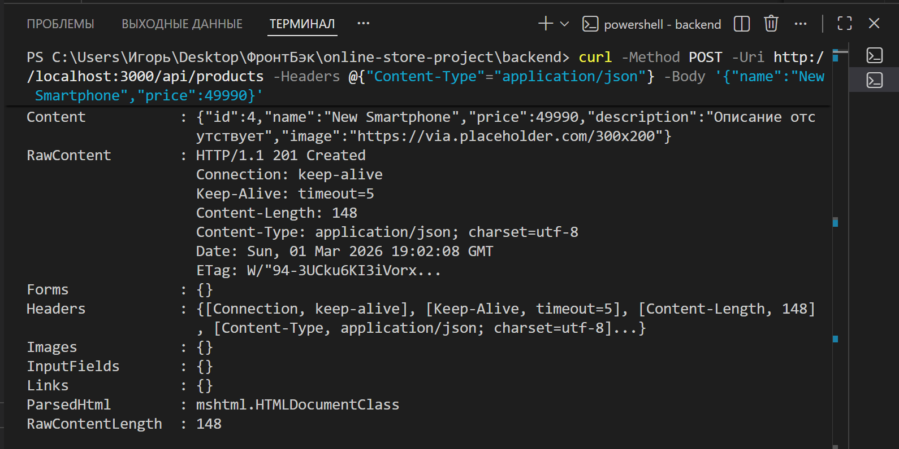

## 2) Вывод
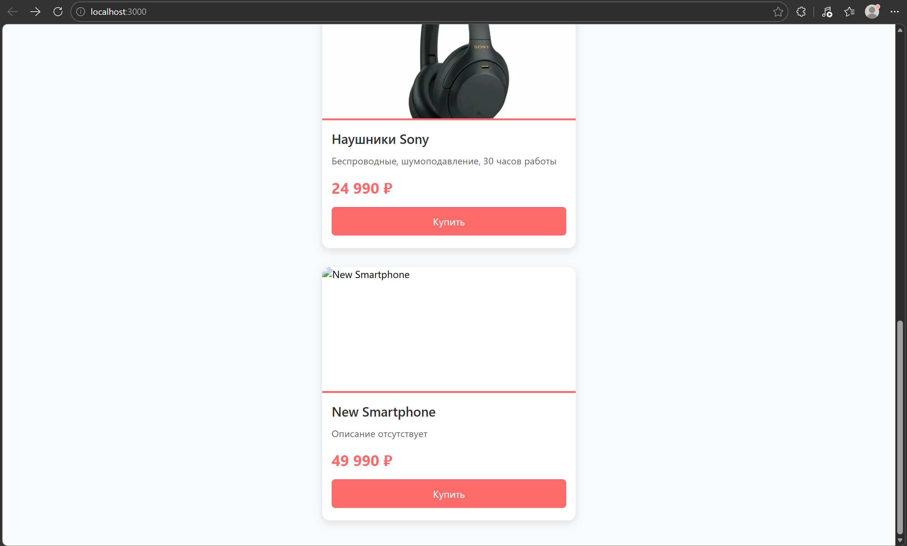

# Практика 3. 
## 1.1) GET все товары
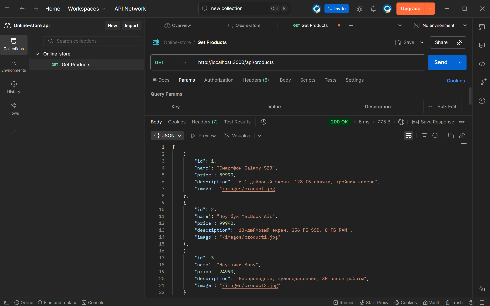

## 1.2) GET товар по ID
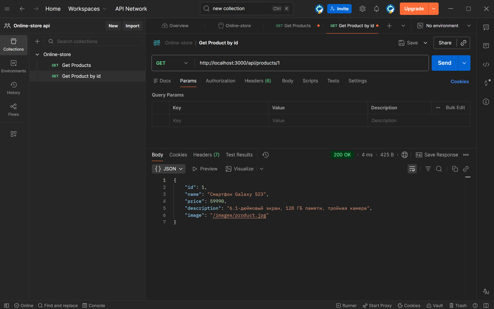

## 1.3) POST создать новый товар
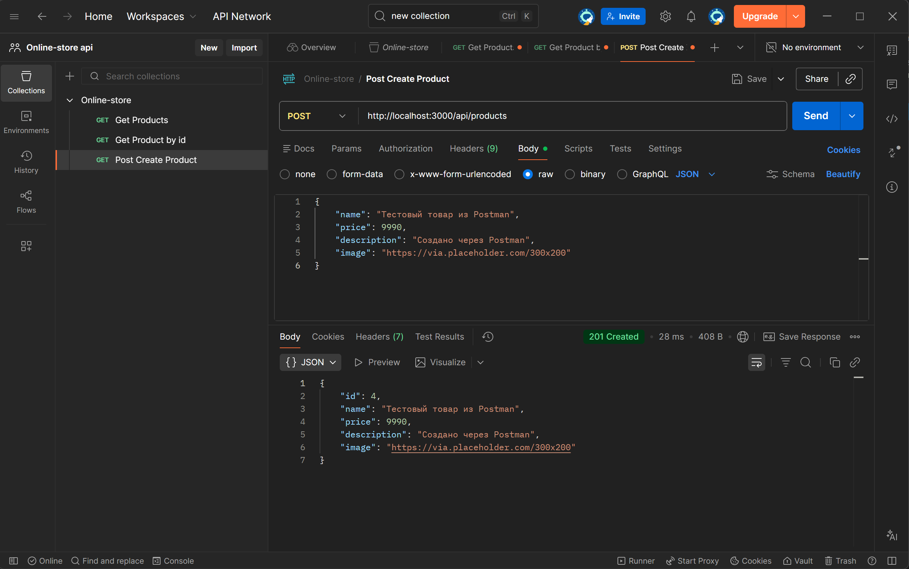

## 2.1) Погода в Москве сейчас
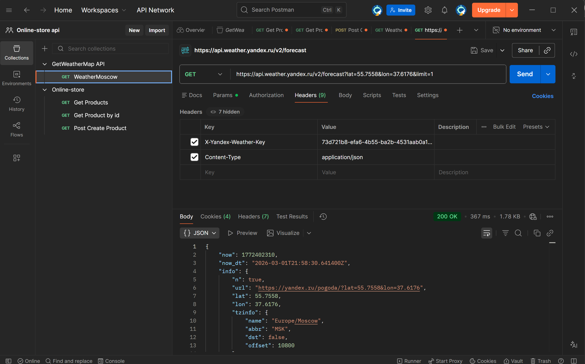

## 2.2) Погода в Санкт-Петербурге
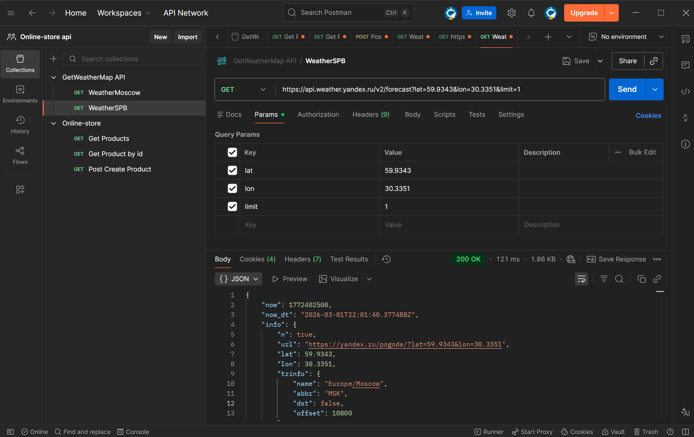

## 2.3) Прогноз погоды в Москве на 3 дня
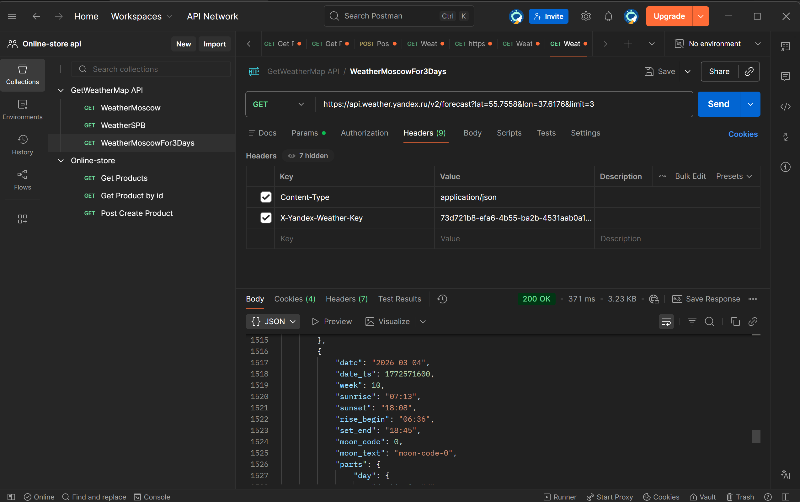

## 2.4) Погода в Казани
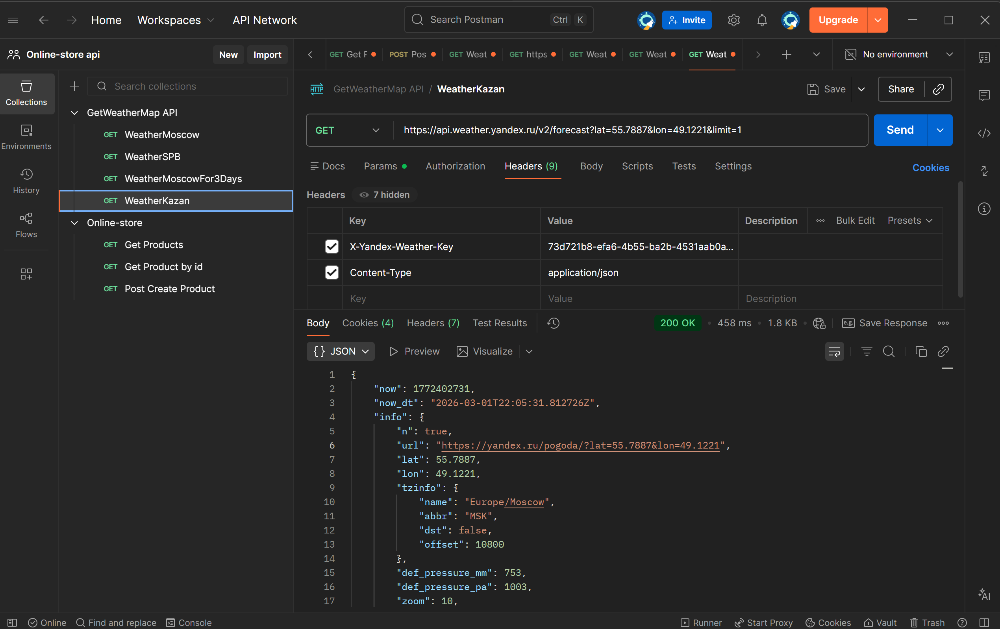

## 2.5) Подробный прогноз для Екатеринбурга
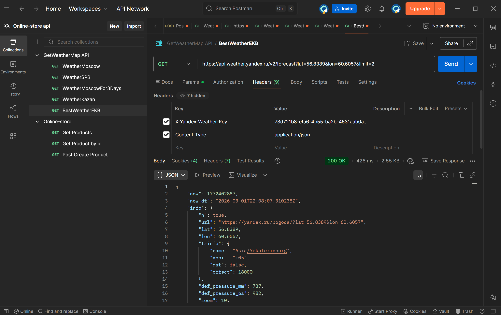

# Практика 4
## Запускается и работает корректно
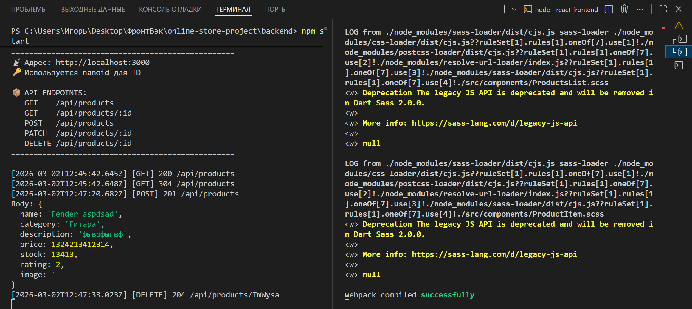

## Вид приложения
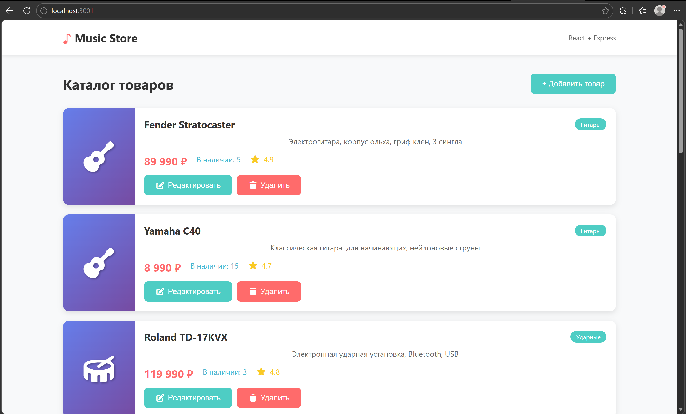

# Практика 5 
## Добавление товара POST api/products
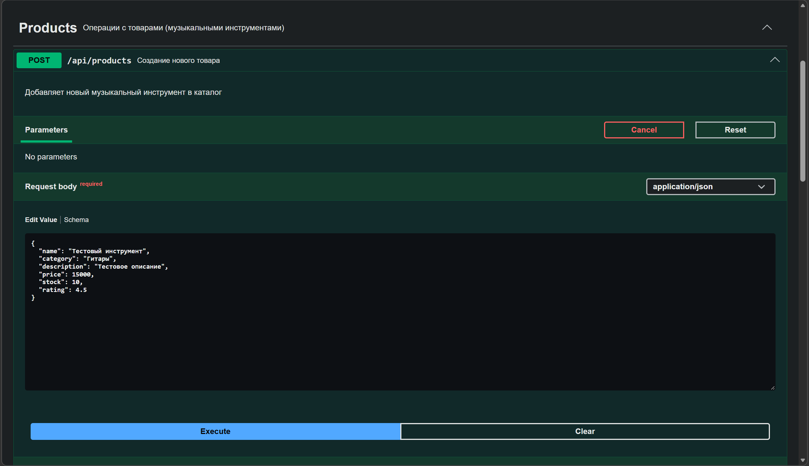

## Результат добавления товара
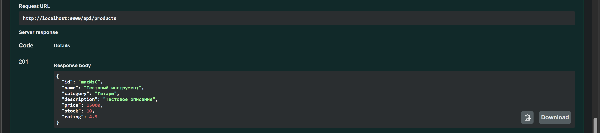

## Схема Product
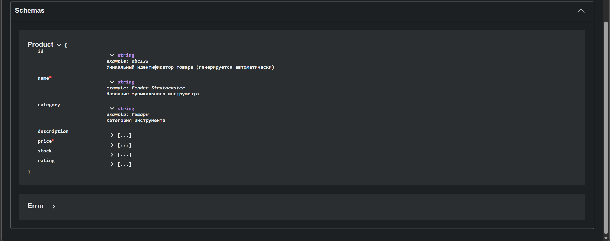

## Получение товара по ID

